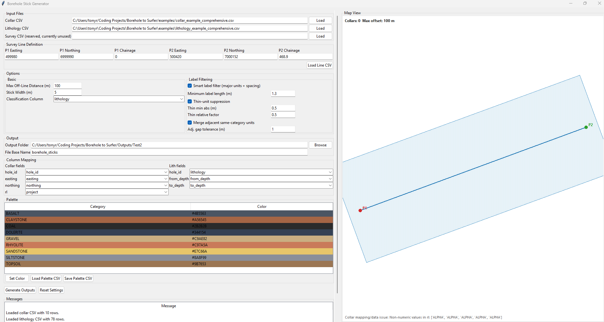
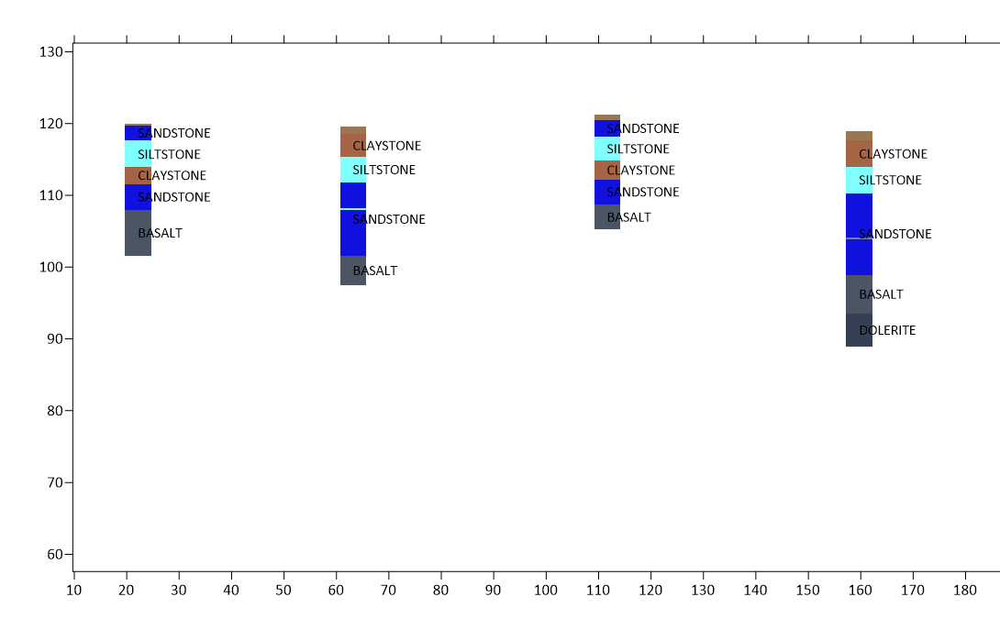

# Borehole to Surfer

Borehole to Surfer is a Windows desktop tool for turning borehole CSV data into Surfer-ready section outputs.

It provides a practical workflow for geologists and engineers:
- load collar + lithology data
- define a section line (`P1`/`P2`)
- preview spatial context in an in-app map
- export files that can be styled and opened in Surfer with minimal manual steps

## Screenshots

### App Window


### Surfer Output Example


> Add your two images at:
> - `docs/images/app-window.png`
> - `docs/images/surfer-output-example.png`

## Features

- Borehole section workflow in a single GUI.
- Flexible column mapping for collar and lithology CSVs.
- Line definition by direct input or line CSV import.
- Right-side map preview with:
  - collar points + `hole_id` labels
  - `P1`/`P2` markers and section line
  - max off-line corridor overlay
  - included vs excluded borehole visibility
- Smart label filtering for cleaner Surfer labels.
- Exports:
  - Shapefile (`.shp/.shx/.dbf/.prj`)
  - BLN polygons (`.bln`)
  - PostMap CSVs (`*_postmap.csv`, `*_postmap_labels.csv`)
  - Palette CSV (`*_palette.csv`)
  - QA CSV (`*_qa.csv`)
  - Surfer auto-load script + runner BAT

## Requirements

- Windows
- Python 3.10+

Install dependencies:

```powershell
python -m pip install -r requirements.txt
```

## Quick Start

### Run from source

```powershell
python borehole_stick_gui.py
```

Alternative:

```powershell
python -m src.borehole_stick_gui
```

### Run with launcher BAT

```powershell
run_borehole_stick_gui.bat
```

The launcher prefers a local `.venv` and will install requirements if needed.

## Typical Workflow

1. Load `Collar CSV` and `Lithology CSV`.
2. Define section line using `P1`/`P2` fields or `Load Line CSV`.
3. Set:
   - `Max Off-Line Distance (m)`
   - `Stick Width (m)`
   - `Classification Column`
4. Review the map panel to confirm included/excluded holes.
5. Configure label filtering options.
6. Choose output folder + base name.
7. Click `Generate Outputs`.

## Input Data

### Required

- Collar CSV
- Lithology CSV

### Optional

- Survey CSV (currently reserved/ignored)

### Line CSV format (optional)

Use columns:

```csv
point,easting,northing,chainage
P1,499980.0,6999990.0,0.0
P2,500420.0,7000152.0,468.9
```

## Example Data

In `examples/`:

- Simple templates:
  - `collar_template.csv`
  - `lithology_template.csv`
  - `palette_template.csv`
- Comprehensive testing set:
  - `collar_example_comprehensive.csv`
  - `lithology_example_comprehensive.csv`
  - `palette_example_comprehensive.csv`
  - `line_example_comprehensive.csv`

## Outputs

For base name `borehole_sticks`, generated files include:

- `borehole_sticks.shp` (+ `.shx/.dbf/.prj`)
- `borehole_sticks.bln`
- `borehole_sticks_postmap.csv`
- `borehole_sticks_postmap_labels.csv`
- `borehole_sticks_palette.csv`
- `borehole_sticks_qa.csv`
- `borehole_sticks_surfer_autoload.py`
- `borehole_sticks_run_surfer_autoload.bat`

## Testing

Run tests:

```powershell
python -m pytest -q
```

## Build EXE

```powershell
python -m PyInstaller --noconfirm --onefile --windowed --name BoreholeToSurfer --exclude-module PyQt5 --exclude-module PyQt6 --exclude-module PySide2 --exclude-module PySide6 borehole_stick_gui.py
```

Output:

- `dist/BoreholeToSurfer.exe`

## Project Structure

- `borehole_stick_gui.py` - launcher
- `src/borehole_stick_gui/` - app source
- `tests/` - automated tests
- `examples/` - sample datasets
- `Outputs/` - generated output examples

## Troubleshooting

- If Surfer does not auto-open, run `*_run_surfer_autoload.bat` manually.
- If no holes appear in the map or exports, check collar mapping (`hole_id`, `easting`, `northing`, `rl`).
- If labels are sparse, relax smart label filtering thresholds.
